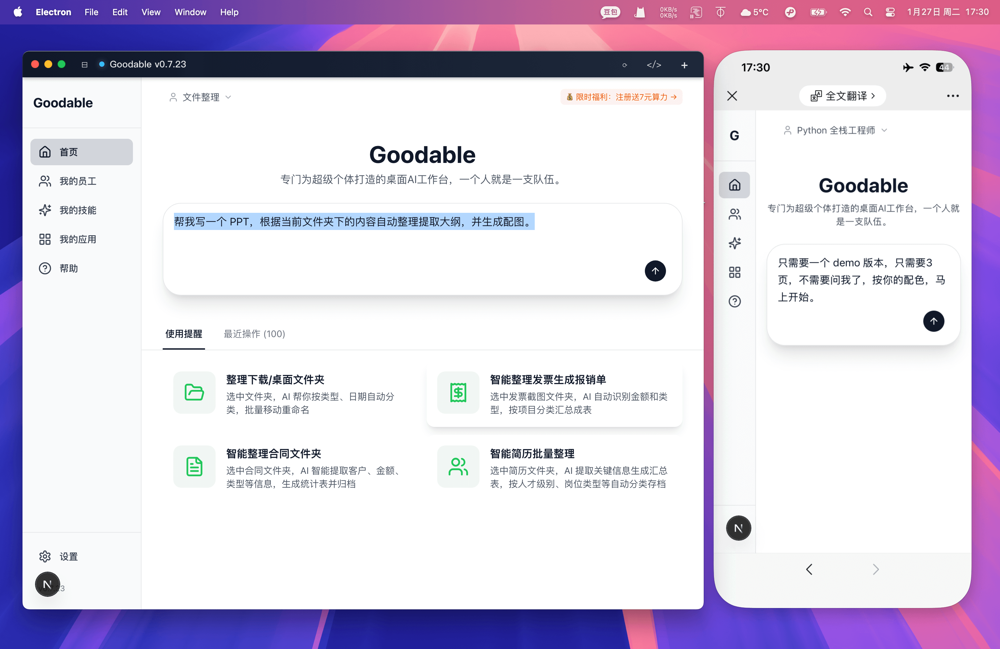
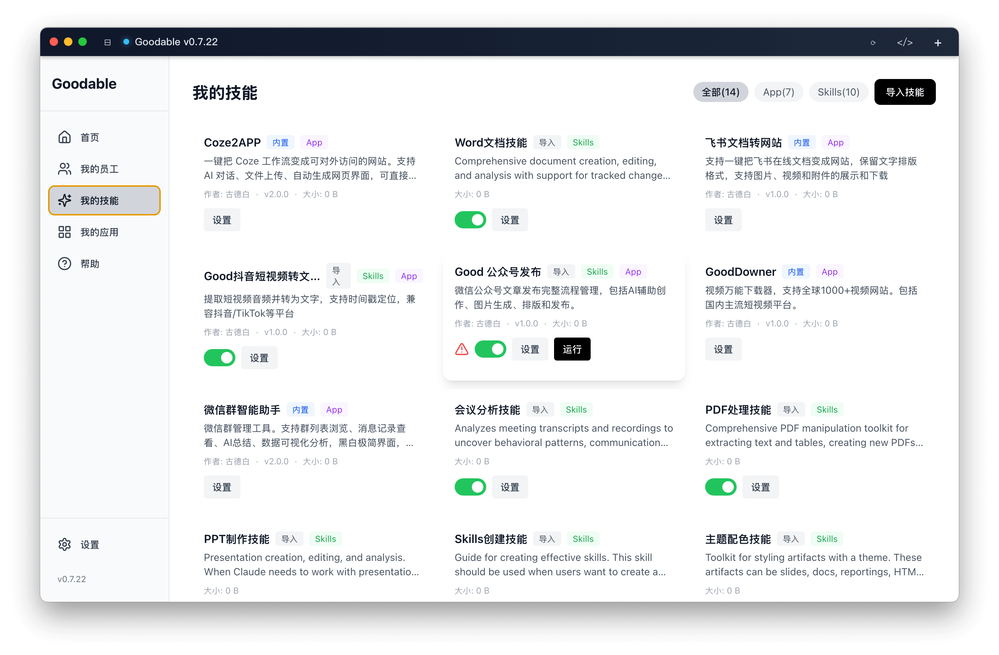
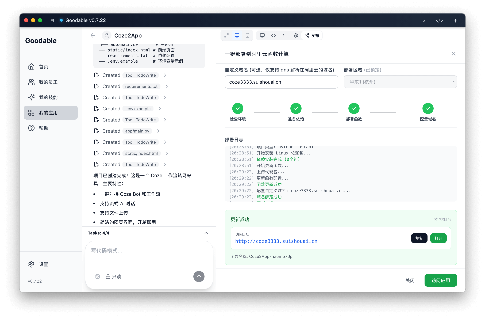
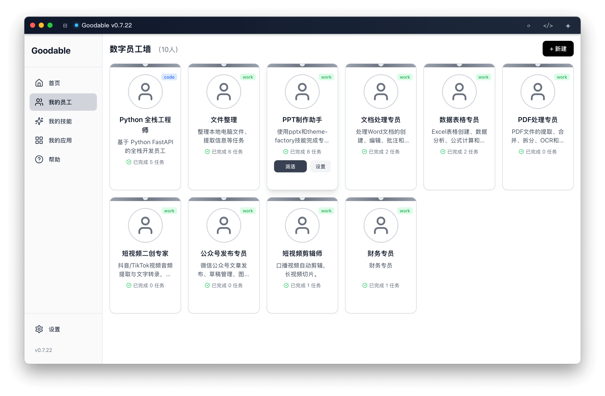
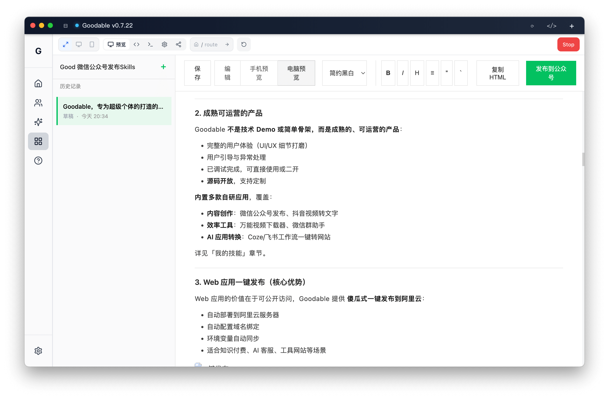
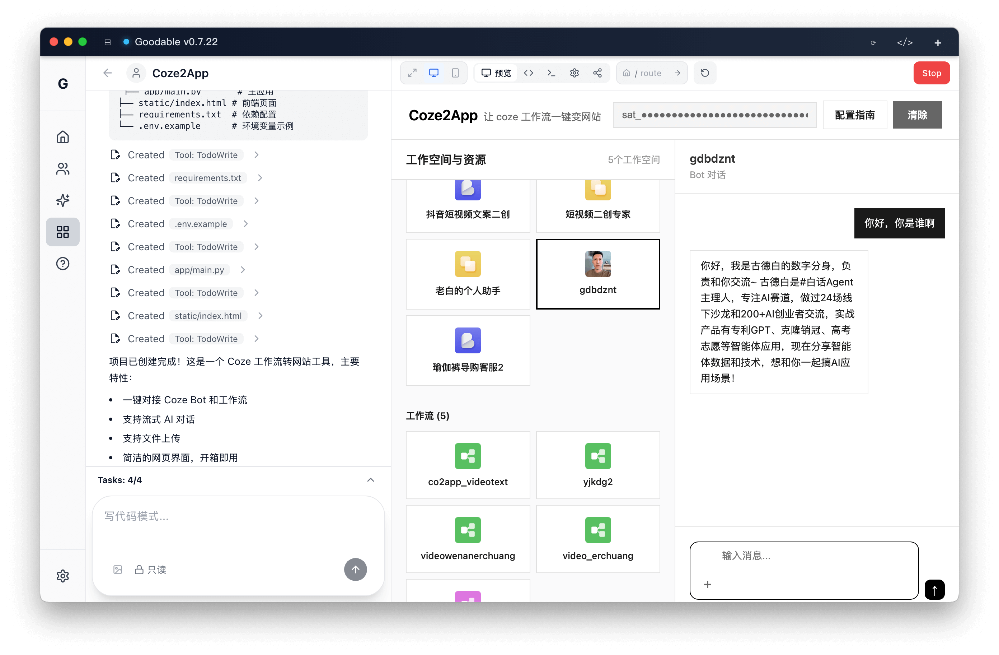
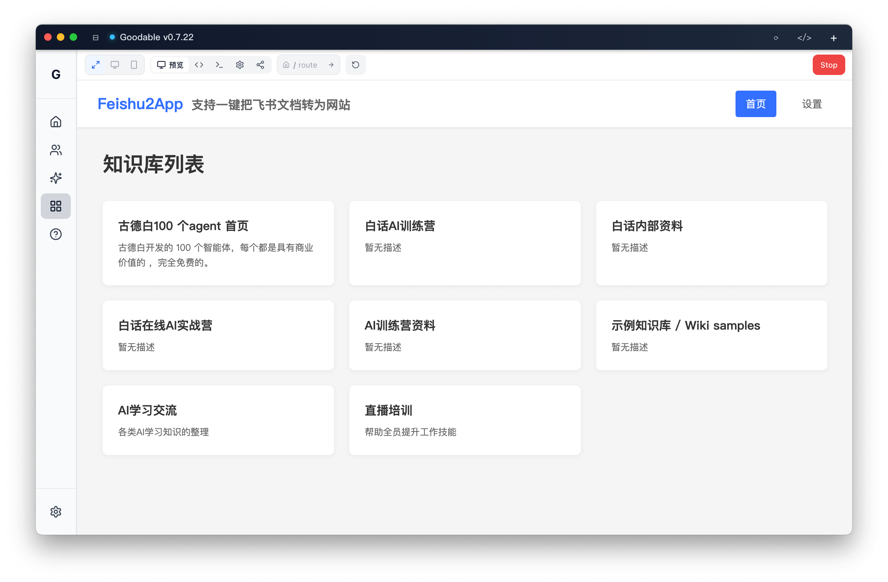

<div align="center">
  
  <h1>Goodable</h1>

  <p>
    <b>中文</b> | <a href="README_EN.md">English</a>
  </p>

  <p>
    专为超级个体的打造的桌面 AI 工作台，使一个人抵一个团队
  </p>
  <p>
    code 和 work 双场景的通用智能体，Skills+ 、内置多款成熟应用、AI 应用生成与一键发布
  </p>

  <p>
    <a href="https://goodable.cn">goodable.cn</a> ·
    <a href="https://github.com/ImGoodBai/goodable/releases">Releases</a> ·
    <a href="https://github.com/ImGoodBai/goodable/issues">Issues</a>
  </p>

  <p>
    
    
    
  </p>
</div>

---

## 一 项目简介

Goodable 是一个桌面 AI 工作台（桌面通用智能体），基于 Claude Agent SDK 驱动，通过预制数字员工、可扩展的 Skills 系统和开箱即用的应用，帮助用户完成本地文件处理、内容创作、AI 应用生成与发布等任务。已支持手机远程遥控任务进度，发送指令和验收结果。

**这是一个成熟的、可直接商业运营的产品**，不是简单的技术 Demo 或开源骨架。包含完整的用户体验、引导流程、异常处理等细节打磨。



### 三大核心能力

Goodable 的所有功能围绕三大核心能力展开：

1. **桌面操作**：电脑屏幕自动化、本地电脑文件智能化处理，办公软件智能化操作
2. **浏览器操作**：网页类信息爬取、自动化发布、自媒体运营全流程自动化
3. **编程开发**：各种 AI 应用一句话生成、一键发布上云，从想法到上线 10 分钟搞定

这三大能力通过 agent 底座能力 + Skills 系统灵活组合，既可在对话中自动调用，也可通过图形界面独立运行。

---

**面向人群：**
- **超级个体**：自媒体运营、行政、财务、客服等多角色一人搞定
- **内容创作者**：希望快速生成并发布 Web 应用的创作者
- **入门级技术爱好者**：对技术感兴趣、想利用 AI快速开发并发布上线应用

**核心价值：**
- **成熟可运营**：完整产品化应用，内置多款自研应用，源码开放
- **Skills 双模式**：AI 自动触发 + 图形化 APP 独立运行，共享环境与数据
- **AI 应用生成与发布**：傻瓜式一键发布到阿里云，自动配置域名
- **预制数字员工**：多款预定义角色提示词，开箱即用
- **集成运行时**：内置 Python + Node.js，无需配置环境


---

## 二 快速开始

### 安装与运行

下载对应平台的安装包，双击安装即可使用：

| macOS (Apple Silicon) | macOS (Intel) | Windows |
|---|---|---|
| [⬇️ 下载](https://github.com/ImGoodBai/goodable/releases/latest) | [⬇️ 下载](https://github.com/ImGoodBai/goodable/releases/latest) | [⬇️ 下载](https://github.com/ImGoodBai/goodable/releases/latest) |

---

## 三 典型使用场景

### 场景 1：桌面智能化自动化

**能力基础**：computer use

**典型流程：**
- 整理发票文件夹 → AI 提取关键信息 → 生成报销单 Excel → 批量重命名归档
- 合同批量整理 → 提取关键条款 → 输出结构化数据
- PDF 文档批量处理 → 提取文本、合并、拆分
- 微信群管理 → 部署微信群助手 → AI 总结 → 数据可视化分析


**核心价值：**
解放重复劳动，让文件夹"自己整理自己"。无需手动打开每个文件，AI 自动识别、提取、归档。

---

### 场景 2：浏览器智能化自动化

**能力基础**：browser use

**典型流程：**
- **自媒体内容发布**：AI 创作公众号文章 → 生成配图 → 自动排版 → 一键发布微信平台
- **短视频内容提取**：爬取抖音视频 → 下载视频 → 提取音频 → ASR 转文字 → 输出带时间戳的文案
- **数据爬取**：批量下载全球 1000+ 视频网站内容，多画质选择，实时进度

**核心价值：**
自媒体运营全流程自动化，从内容创作、素材获取到平台发布，一站式完成。

---

### 场景 3：一句话生成可商业发布的AI 应用

**能力基础**：vibecoding + 云端发布

**典型流程：**
- **Coze 工作流上线**：复制 Coze2App → 配置 API → 一键发布阿里云 → 绑定域名上线（10 分钟）
- **知识库网站生成**：飞书文档 → 一键转网站 → 对外展示企业知识库

**核心价值：**
从想法到上线，10 分钟搞定。适合知识付费、AI 客服、工具网站等场景，开箱即用。

---

## 四 核心特性

### 1. Skills 双模式创新（核心亮点）

Goodable 扩展了 Claude Skills 能力，在保留 Skills 自动触发能力的基础上，创新性地增加了 **图形化 APP 模式**：

**Skills 模式（官方能力）：**
- AI 在对话中自动触发相应 Skill
- 灵活自由，由 AI 决策何时调用
- 适合快速集成到对话流程

**图形化 APP 模式（Goodable 创新）：**
- 独立的 Web 界面，用户体验完整
- **绝对可控**：运行稳定，交付结果确定
- **共享环境与数据**：与 Skills 模式共享数据目录，可在图形界面中验证 Skills 操作结果
- 解决了 Skills 在部分场景下不可控的问题

**技术实现：**
APP 模式本质是可独立运行的源码应用（Python FastAPI / Next.js），通过单实例锁确保与 Skills 模式数据共享。

**优势：**
- 开发者：一套代码，两种使用方式
- 用户：在命令行操作后，可在图形界面做最终确认
- 可导入/导出：Skills 支持 ZIP 打包导出



---

### 2. 成熟可运营的产品

Goodable **不是技术 Demo 或简单骨架，而是成熟的、可运营的产品**：

- 完整的用户体验（UI/UX 细节打磨）
- 用户引导与异常处理
- 已调试完成，可直接使用或二开
- **源码开放**，支持定制

**内置多款自研应用**，覆盖：
- **内容创作**：微信公众号发布、抖音视频转文字
- **效率工具**：万能视频下载器、微信群助手
- **AI 应用转换**：Coze/飞书工作流一键转网站

详见「我的技能」章节。


---

### 3. Web 应用一键发布（核心优势）

Web 应用的价值在于可公开访问，Goodable 提供 **傻瓜式一键发布到阿里云**：

- 自动部署到阿里云服务器
- 自动配置域名绑定
- 环境变量自动同步
- 适合知识付费、AI 客服、工具网站等场景



---

### 4. 预制数字员工（开箱即用）

预定义了多款角色和提示词，覆盖常见办公/创作场景：

- 文案撰写、数据分析、代码助手等
- 一键切换角色，快速启动对话
- 体现"开箱即用"的产品价值

目前 Skills 由 AI 动态调用，未来可扩展更多场景。



---

### 5. 内置环境变量注入机制

学习扣子的 built-in 服务思路，通过 System Prompt 分层注入环境变量：

- 在主应用配置 API 密钥（如飞书、微信、ASR 服务等）
- 子应用/Skills 通过配置文件声明需要的环境变量
- AI 自动读取并注入到运行时，无需重复配置


用户在 UI 界面填写后，Skills 运行时自动获取环境变量。

---

### 6. 集成 Python + Node.js 运行时

Windows 和 macOS 安装包内置运行时，用户无需安装 Python 或 Node.js 环境。

---

### 7. 应用时间线管理

每个子应用自动记录操作日志（JSON + TXT 格式），支持回溯与审计。

---

## 五 功能模块

### 我的技能（Skills 系统）

Goodable 支持三种类型Skills：

1. **纯命令行 Skills**：只有 `SKILL.md`，在聊天窗口调用
2. **纯 APP 应用**：只有 `template.json` + `projectType`，图形界面运行
3. **混合模式**：同时拥有 `SKILL.md` 和 `projectType`，支持双模式

---

#### 预制Skills（自研，可直接使用）

以下应用**由古德白自研开发**，已完成产品化打磨，源码开放：

**1. Good 公众号发布**（混合模式）
- **功能**：微信公众号文章创作、图片生成与上传、草稿创建、一键发布
- **特色**：
  - Web UI 可视化管理（文章 CRUD、在线编辑）
  - 支持 Markdown 编辑，自动转 HTML
  - 数据库持久化（SQLite），发布历史记录
  - 命令行脚本支持自动化场景
- **技术栈**：Python FastAPI + SQLite
- **适用场景**：自媒体运营、内容团队



**2. Good 抖音短视频转文字**（混合模式）
- **功能**：提取短视频音频并转为文字，支持时间戳定位
- **特色**：
  - 支持抖音/TikTok 等平台
  - Web UI 粘贴链接即可转写
  - 实时进度更新
  - Cookie 管理支持受限视频
  - 输出格式：文本 / JSON（含时间戳）
- **技术栈**：Python FastAPI + TikTokDownloader + ASR 服务
- **适用场景**：短视频创作者、字幕提取、内容分析

**3. GoodDowner - 万能视频下载器**（混合模式）
- **功能**：支持全球 1000+ 视频网站下载
- **特色**：
  - 多画质选择（最佳/1080p/720p/480p）
  - 实时进度显示
  - 异步后台下载
  - 支持 B站、YouTube、抖音、Twitter 等主流平台
- **技术栈**：Python FastAPI + yt-dlp
- **适用场景**：视频资料收集、离线观看

**4. Coze2App**（混合模式）
- **功能**：一键把 Coze 工作流变成可访问的网站
- **特色**：
  - OAuth 2.0 授权，自动获取 Bot 列表
  - AI 对话、文件上传
  - Material Design 界面
  - 适合知识付费、AI 客服、智能工具等商业化场景
- **技术栈**：Python Flask / FastAPI
- **适用场景**：Coze 用户快速商业化



**5. 飞书文档转网站**（混合模式）
- **功能**：一键把飞书在线文档变成网站
- **特色**：
  - 保留文字排版格式
  - 支持图片、视频和附件展示/下载
  - 适合知识库、产品文档对外展示
- **技术栈**：Python FastAPI
- **适用场景**：企业知识库、产品文档站



**6. 微信群智能助手**（混合模式）
- **功能**：微信群管理工具
- **特色**：
  - 群列表浏览、消息记录查看
  - AI 总结、数据可视化分析
  - 黑白极简界面
  - 基于 RPA 自动化（仅支持 Windows 10/11）+ AI 技术
- **技术栈**：Python FastAPI + RPA
- **适用场景**：社群运营、客服管理


---

#### 集成 Skills

以下 Skills 集成自 Claude 官方能力：

- **PDF 处理**：提取文本、合并、拆分
- **DOCX 处理**：文档生成与编辑
- **XLSX 处理**：表格数据读写
- **PPTX 处理**：演示文稿生成

---

---


## 六 技术架构

<details>
<summary><b>展开查看技术细节</b></summary>

### 主项目 vs 子应用

- **主项目**：Goodable 平台本身（当前目录）
- **子应用**：用户生成的应用，存储在 `PROJECTS_DIR` 目录
- **Skills 目录**：内置 Skills 在 `skills/`，用户 Skills 在 `user-skills/`

### 环境变量注入机制

通过 System Prompt 分层注入：

1. 主应用读取用户配置的 API 密钥
2. 子应用/Skills 的 配置文件声明所需环境变量
3. AI 在运行时自动注入到 `.env` 文件或进程环境

### 进程管理与并发

- 支持多个应用并发运行
- 进程级隔离，避免端口冲突
- 任务队列调度与异常恢复

### 稳定性保障

- 进程同步锁（防止重入）
- 单实例运行（APP 模式）
- 异常捕获与日志记录

</details>

---

## 七 使用指南

### 普通用户

1. 下载安装包并安装
2. 配置 API Key
3. 选择数字员工或者技能
4. 开始对话或运行项目

### 开发者

**源码运行：**

```bash
git clone https://github.com/ImGoodBai/goodable.git
cd goodable
npm install
npm run dev:electron
```

---

### 贡献指南

见 `CONTRIBUTING.md`

---

## 八 FAQ

**Q: 什么是 Skills 混合模式？**

A: 混合模式是 Goodable 的创新特性，同一个应用既可以作为命令行 Skill 在聊天窗口调用（灵活自由），也可以作为图形化 APP 独立运行（稳定可控）。两种模式共享数据目录，通过单实例锁保证数据一致性。

**Q: Skills 如何导入/导出？**

A: Skills 支持 ZIP 打包导出，可快速分享到其他环境。导出的 ZIP 包含完整的代码、配置和依赖声明，导入后即可使用。

**Q: 支持哪些平台？**

A: macOS（Intel + Apple Silicon）和 Windows，Linux 可源码运行。

**Q: 子应用存储在哪里？**

A: 默认在 `~/goodable-projects`，可在设置中修改 `PROJECTS_DIR`。

**Q: 如何更新内置 Skills？**

A: 更新 Goodable 版本后，内置 Skills 会自动覆盖更新，用户导入的 Skills 不受影响。

**Q: 预制应用和开源骨架有什么区别？**

A: 预制应用是经过产品化打磨的完整应用，包含 UI/UX 细节、用户引导、异常处理等，可直接使用或二开。不同于只有核心代码的开源骨架。

---

## 九 Roadmap

### 近期计划

正在编写，你有想法，来提哦

---

## 文档与支持

- **联系我**：[goodable.cn](https://goodable.cn)
- **问题反馈**：[GitHub Issues](https://github.com/ImGoodBai/goodable/issues)（建议附截图/日志）
- **贡献代码**：见 `CONTRIBUTING.md`
- **安全问题**：见 `SECURITY.md`

---

## License

MIT License - 详见 [LICENSE](LICENSE)

---

## 免责声明

请在遵守各平台协议与当地法律法规的前提下使用相关能力（如内容下载、自动化发布、机器人等）。

---

<div align="center">
  <p>⭐ 如果 Goodable 对你有帮助，欢迎 Star 支持</p>
</div>
